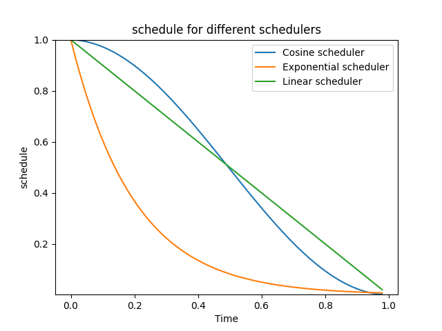
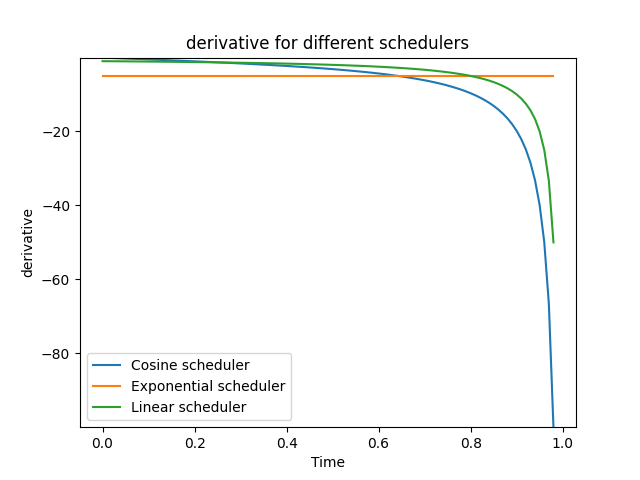
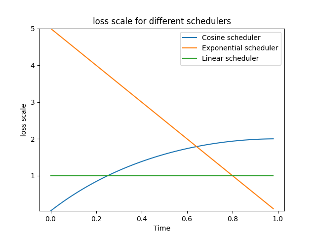
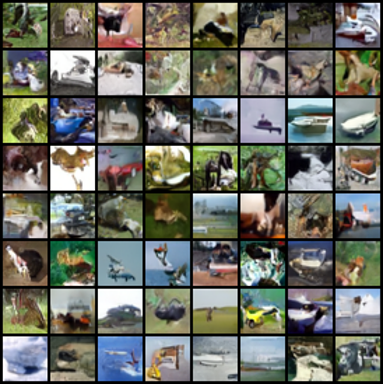
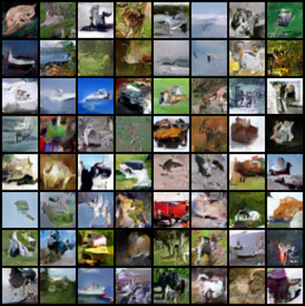
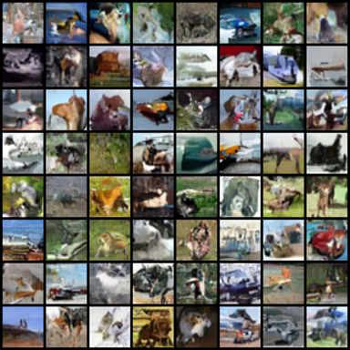

# Different Schedulers for Training Flow Matching Models

By Chaoran Cheng, Yen-Chi Cheng, and Yao Xiao

In this repo, we tested different flow matching schedulers on the final performance of the flow matching models.
To set up the environment, run the following command:

```bash
bash setup.sh
```

To train the models, run the following command:

```bash
python train.py <config-file>.yml --savename <save-name>
```

For example, run the following code to train the model with the linear scheduler on CIFAR-10 dataset:

```bash
python main.py configs/cifar10_linear.yml --savename cifar10_linear
```

To test the models, run the following command:

```bash
python main.py <config-file>.yml --mode inf --savename <save-name> --resume <model-path>
```


All models are trained and test on the CIFAR-10 raw images. We tested with the linear scheduler, the exponential scheduler, and the cosine scheduler. The different schedules are demonstrate in the below figure:





The first figure demonstrate the schedule values which decrease over time from 1 to approximately 0. The second figure demonstrate the derivative of the schedule values used in training the vector fields. The third figure demonstrate normalized derivatives of the schedule values, which corresponds to the loss scale values at any timestep. From the visualization, the linear scheduler approaches the target distribution at
a constant rate. In contrast, the exponential scheduler demonstrates a swift convergence towards lower schedule values
at the beginning of the training process. The cosine scheduler decreases slowly first and then decreases fast.

The linear, exponential, and cosine schedulers achieve FID scores of **24.89, 49.85, and 27.92**, respectively. The generated images use the ODE solver are shown below:

Linear Scheduler:<br>


Exponential Scheduler:<br>


Cosine Scheduler:<br>


The generated trajectories are also provided below. Note how the denoise speed is different for different schedulers:

Linear Scheduler:<br>


Exponential Scheduler:<br>


Cosine Scheduler:<br>


